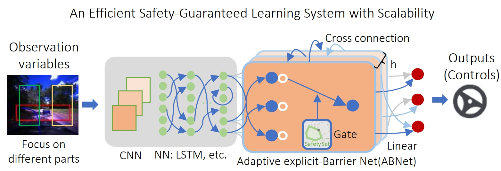

# ABNet
Adaptive explicit-Barrier Net for Safe and Scalable Robot Learning (Implementation of our ICML 2025 paper)

 


# Install eBQP (explicit-Barrier based QP solver)
```
conda create -n abnet python=3.8
conda activate abnet
cd eBQP
pip install -e .
```

## Introduction to eBQP

eBQP is a quadratic program (QP) solver that gives the closed-form solution of a QP, which shows superior performance and stability compared to existing solvers (such as QPFunction in qpth from OptNet). The comparison results are shown in the paper.

eBQP only considers inequality constraints of a QP (most CBF-based methods are based in this form) in the form (an equality constraint can be transformed into two inequality constraints):

min_x (1/2 x^THx + F^Tx)

s.t. Ax <= b

where

H - dimension: (nBatch, q, q) (dimension of x is q)

F - dimension: (nBatch, q)

A - dimension: (nBatch, nConstraints, q)

b - dimension: (nBatch, nConstraints)

## Usage of eBQP:
```
from eBQP import eBQP

x = eBQP(H, F, A, b)
```

# Install other packages (vista, torch, etc.)
```
conda activate abnet
cd driving_abnet/vista
pip install -e .
pip install torch==1.10.1+cu113 torchvision==0.11.2+cu113 -f https://download.pytorch.org/whl/cu113/torch_stable.html
pip install pytorch-lightning==1.5.8 opencv-python==4.5.2.54 matplotlib==3.5.1 ffio==0.1.0  descartes==1.1.0  pyrender==0.1.45  pandas==1.3.5 shapely==1.7.1 scikit-video==1.1.11 scipy==1.6.3 h5py==3.1.0
pip install qpth cvxpy cvxopt
```


# Reference
If you find this helpful, please cite our work:
```
@inproceedings{xiao2025abnet,
  title = {ABNet: Adaptive explicit-Barrier Net for Safe and Scalable Robot Learning},
  author = {Wei Xiao and Tsun-Hsuan Wang and Chuang Gan and Daniela Rus},
  booktitle = {International Conference on Machine Learning},
  year = {2025}
}
```
